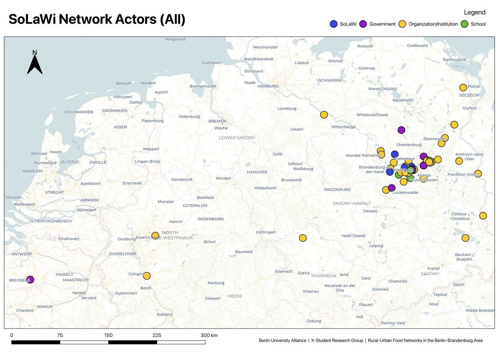
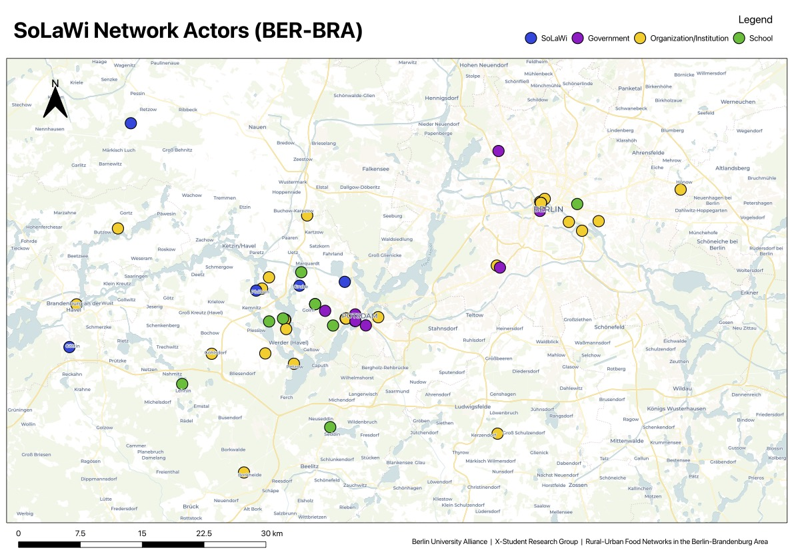
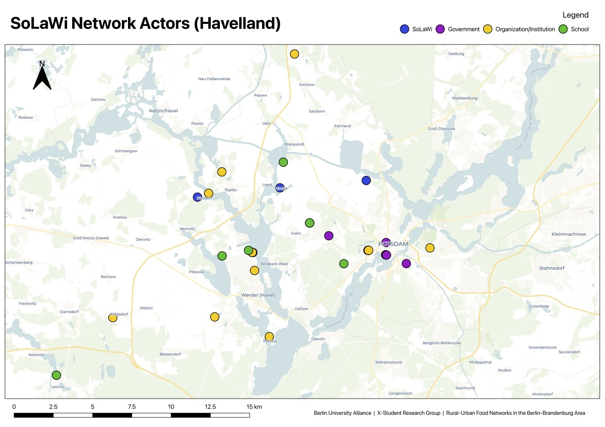

# CSA BER-BRA Network Explorer

### Mapping rural–urban food networks across Berlin-Brandenburg

[**Launch Interactive Explorer →**](https://charlesellingham.github.io/CSA-BER-BRA-Network-Explorer/)

## The Project

This social network analysis project was developed through the Berlin University Alliance’s X-Student Research Group “How can a box of vegetables weave places together? Rural-Urban food networks in the Berlin-Brandenburg area,” led by Federica Ammaturo and supported by Chen Gao from Geography at Humboldt-Universität in Berlin. X-Student Research Groups aim to give students the opportunity to participate in collaborative research projects and develop their own research questions and methods within Berlin’s university research environment.

The research group focuses on Community Supported Agriculture (CSA), or Solidarische Landwirtschaft (SoLaWi) in German, investigating how rural-urban food networks connect people, places and resources through alternative, place-based food value chains. The wider project examines how these networks affect socio-economic and spatial development and what they can reveal about regional development and broader socio-ecological transformations. The group combines qualitative and quantitative research, including surveys, field visits and workshops with network members and experts, with the intention of integrating the results into a story map.

The CSA BER-BRA Network Explorer forms part of this broader research process, developing the network-mapping and quantitative analysis component of the project while also experimenting with ways of making the research data accessible through an interactive digital tool.

## Developing the Methodology

The network was initially constructed using a snowball-style approach. It began with **BAUERei Potsdam-Grube** as a starting actor and progressively identified additional actors through their documented relationships using publicly available data and desktop research methods.

As the network developed, a structured dataset of actors and relationships was built, categorising actors by type and relationships by category. This provided the basis for both the visual network and subsequent quantitative analysis. The current network is a simplified representation only and represents just the relationships identified through this research process rather than a complete representation of every CSA actor or relationship in Berlin-Brandenburg.

The starting-point methodology is also important when interpreting the results. Because the network was initially built outward from BAUERei, it is expected that BAUERei will appear particularly central within the resulting network.

## Network Analysis and Developing the Explorer

I used **Gephi** to conduct an initial quantitative analysis of the network and explore its structure. This included measures such as:

- Degree
- Betweenness centrality
- Closeness centrality
- Eigenvector centrality
- PageRank

The analysis indicated that **BAUERei Potsdam-Grube** and **BioRegion Havelland** occupy particularly prominent positions within the mapped network. Rather than treating these measures as definitive rankings, I use them to identify patterns that can be explored through further qualitative and geographical research.

## Interactive Network Explorer

While Gephi was useful for calculating these network measures and initially visualising the relationships, I found its visualisation and interaction options limiting for the way I wanted to explore and communicate the network. I therefore decided to develop my own interactive network visualisation using **JavaScript and Cytoscape.js**. Building the Explorer myself allowed me to move beyond a static network visualisation and develop features specifically suited to the research, including filtering by actor and relationship type, selecting network neighbourhoods, hiding actors, exploring individual connections, and controlling how relationships and labels are displayed.

The Explorer is intended as both a research tool and a way of communicating the network to people who may not be familiar with network analysis. It currently allows users to:

- Explore individual actors and their connections
- Filter actors by type
- Filter relationships by type
- Select multiple actors and their neighbourhoods
- Hide individual actors
- Reset hidden actors
- Toggle relationship curves
- Toggle actor names
- View information about individual actors
- Explore an actor's documented connections

This process also became an important part of the methodological development of the project, as I moved from using an existing analytical tool towards building a customised digital research tool around the specific needs of the dataset and research questions.

## Geographical Distribution and QGIS Analysis

Alongside the network analysis, I mapped the geographical distribution of all identified actors using **QGIS**. Each actor was geocoded and placed within the Berlin-Brandenburg region, allowing the network to be examined spatially as well as relationally.

The maps provide a geographical perspective on the network, showing where CSA initiatives, organisations, government actors, schools, depots and other actors are located and how the network extends between urban and rural areas.

This spatial analysis complements the network analysis by highlighting the relationship between **where actors are located and how they are connected**. It also provides a basis for exploring questions around rural-urban connections, geographical concentration and the spatial reach of the CSA network.

### Geographical Distribution

<table>
  <tr>
    <td align="center">
      <strong>All Actors</strong> 
      
    </td>
    <td align="center">
      <strong>Berlin-Brandenburg</strong> 
      
    </td>
    <td align="center">
      <strong>Havelland</strong> 
      
    </td>
  </tr>
</table>

Downloads:
- [View all mapped actors – Europe](./A3_SoLaWi_Network_All.pdf)
- [View mapped actors – Berlin-Brandenburg](./A3_SoLaWi_Network_Berlin_Brandenburg.pdf)
- [View mapped actors – Havelland](./A3_SoLaWi_Network_Havelland.pdf)

## What I Have Learned

This project has developed from a relatively simple network mapping exercise into a broader exploration of digital research methods. Building the Explorer has also required me to think more carefully about how research data is structured, how methodological decisions affect quantitative results, and how complex network information can be communicated through an accessible interface. The technical development is therefore closely connected to the methodological development of the research itself.

Through the process I have worked with:

- Desktop dataset collection methodologies
- Structured and unstructured CSV datasets
- Network data modelling techniques
- QGIS and spatial data
- Gephi and quantitative network analysis
- Cytoscape.js
- JavaScript
- HTML and CSS
- Interactive data visualisation
- GitHub and GitHub Pages

## Current Limitations

The network represents documented relationships identified through the current research process and should not be interpreted as a complete representation of the regional CSA system in the Berlin-Brandenburg area. The snowball approach means that actors connected to the initial starting point are more likely to have been identified, while less-connected or more distant actors may be underrepresented. The current analysis is also deliberately exploratory and top-level. More extensive community detection, longitudinal analysis, geographical analysis and additional data collection could provide a more detailed understanding of the network.

## Future Development

Future iterations may expand the dataset, refine the methodology and introduce additional network and spatial analysis.

Potential developments include:

- Community detection
- Additional network metrics
- Improved geographical analysis
- Expanded actor and relationship data
- Historical network comparison
- Improved interactive filtering and visualisation

The project is intentionally being developed incrementally, with the methodology, dataset and digital tool informing one another as the research progresses.
